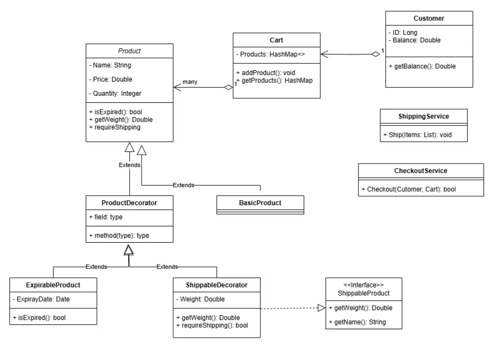
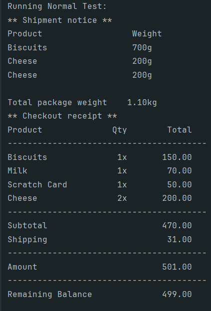
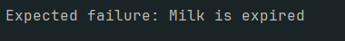
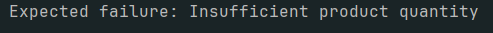
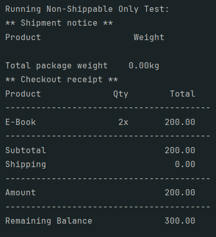

# E-Commerce-Backend

**CLI E-Commerce implementation in java**

## Problem Statement

Design an e-commerce system that has these features:

- Define products with name, price and quantity.
- Some products may expire like Cheese and Biscuits while others may not expire like TV and Mobile.
- Some products may require shipping like Cheese and TV, other products like Mobile scratch cards may not require so. every shippable item should provide its weight.
- Customers should be able to add a product to cart with specifi c quantity not more than the available product quantity.
- Customers are able to do checkout with items in the cart.
  - Print in the console checkout details like
    - order subtotal (sum of all items’ prices)
    - shipping fees
    - paid amount (subtotal + shipping fees)
    - customer current balance after payment
  - Give an error if
    - Cart is empty
    - Customer's balance is insufficient.
    - one product is out of stock or expired. - If applicable, collect all items that need to be shipped and send them to ShippingService which accepts a list of objects implementing an interface containing only String getName() and double getWeight() methods.

## Class Diagram

[Full Resolution](https://drive.google.com/file/d/1jUq8JCnh10phKv6lk1EsNS1EJE_OOuB8/view?usp=sharing)

## Test Cases

**1- Normal Operation**

**2- Expired Items**

**3- Out of Stock**

**4- Empty Cart**

**5- No Shipping**

